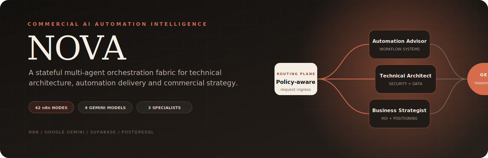
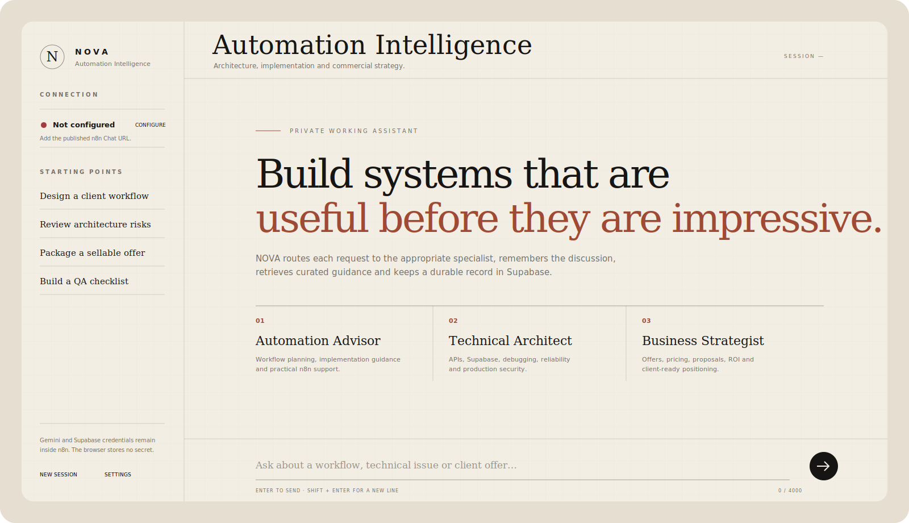
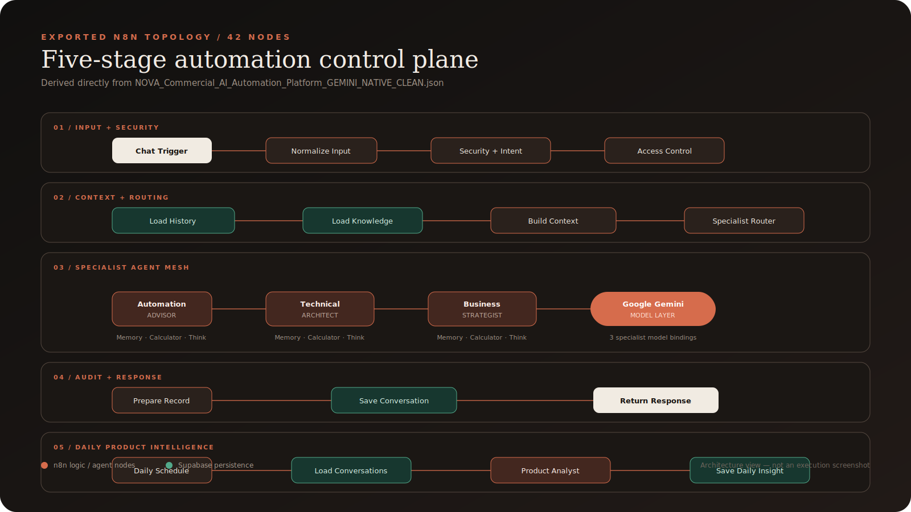
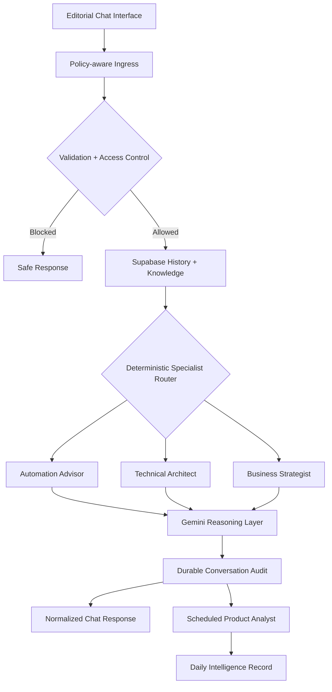

<div align="center">



# NOVA

### Commercial AI Automation Intelligence Platform

**A stateful, multi-agent automation advisory system engineered with n8n, Google Gemini, Supabase, deterministic routing, durable memory and scheduled product intelligence.**

[](https://n8n.io/)
[](https://ai.google.dev/)
[](https://supabase.com/)
[](LICENSE)

**42 nodes · 3 specialist agents · 1 product analyst · 5 control-plane stages · 3 persistent tables**

</div>

---

## The executive signal

NOVA is not a decorative chatbot wrapped around an API call. It is a **domain-specific automation intelligence layer** that converts an open-ended user request into a governed, traceable and commercially useful response path.

The platform combines a **policy-aware ingress layer**, **stateful conversational architecture**, **domain-grounded retrieval**, **deterministic specialist routing**, a **modular agent mesh**, **server-side credential isolation**, **durable operational telemetry** and an independent **product-intelligence pipeline**.

> **Engineering thesis:** model intelligence becomes commercially valuable only when it is surrounded by deterministic control logic, persistent state, explicit security boundaries and observable business workflows.

NOVA demonstrates that thesis as a recruiter-visible systems project: the model reasons, but the automation control plane decides how requests enter, where context comes from, which specialist receives the work, what is persisted and how usage becomes product insight.

## System telemetry at a glance

| Signal | Implementation |
| --- | --- |
| **Workflow surface** | 42 native n8n nodes organized across five documented stages |
| **Agent topology** | Automation Advisor, Technical Architect, Business Strategist and scheduled Product Analyst |
| **Model layer** | Four native Google Gemini Chat Model bindings |
| **Persistence fabric** | Five Supabase workflow nodes backed by three PostgreSQL tables |
| **Agent utilities** | Three memory buffers, four Calculator tools and four Think tools |
| **Routing plane** | Explicit security/access switch plus deterministic specialist router |
| **Experience layer** | Responsive, zero-framework HTML/CSS/JavaScript interface with safe Markdown rendering |
| **Security posture** | Input normalization, length controls, risk flags, RLS and server-side secrets |
| **Analytics loop** | Scheduled conversation aggregation and AI-generated daily product intelligence |

## Product interface



<p align="center"><sub>Interface preview derived from the committed <code>frontend/index.html</code>: editorial layout, specialist entry points, local session handling and credential-safe connection setup.</sub></p>

The frontend is deliberately restrained. It behaves like a private technical workbench rather than a generic consumer chat clone:

- recruiter-readable product positioning above the fold
- one-click starting points for workflow design, architecture review, offer packaging and QA
- session-scoped visible history in the browser
- safe Markdown headings, tables, code blocks and lists
- connection setup without exposing Gemini or Supabase secrets
- responsive desktop/mobile behavior with no frontend framework dependency

## Orchestration topology



<p align="center"><sub>Architecture view generated from the committed 42-node n8n export. It represents the real node topology, not a fabricated execution screenshot.</sub></p>



## Why NOVA instead of a generic AI chatbot?

A generic chatbot usually treats every prompt as an isolated inference request. NOVA treats the prompt as an **operational event moving through a governed decision system**.

| Capability | Generic chat wrapper | NOVA intelligence layer |
| --- | --- | --- |
| Request handling | Prompt goes directly to one model | Normalized, validated and checked before inference |
| Expertise | Undifferentiated assistant persona | Deterministic routing across three specialist roles |
| Context | Current prompt or transient chat | Durable Supabase history plus local agent memory |
| Grounding | Broad model knowledge | Curated domain knowledge retrieved from PostgreSQL |
| Security | Mostly prompt instructions | Explicit risk flags, length policy, access switch, RLS and credential isolation |
| Observability | Often opaque | Route, model, metadata, timestamps and risk signals are persisted |
| Product learning | Manual transcript review | Scheduled Product Analyst converts activity into structured insights |
| Control surface | Provider-controlled interface | Human-readable, self-hostable n8n orchestration plane |
| Commercial output | General advice | Dedicated pricing, ROI, proposal and positioning specialist |

This architecture does not pretend the language model is an autonomous business. Instead, it uses the model as a bounded reasoning component inside an inspectable automation system.

## Specialist agent mesh

### 01 — Automation Advisor

The workflow-engineering specialist. It handles discovery, n8n architecture, node selection, integrations, idempotency, failure recovery, validation and implementation sequencing.

**Operating lens:** turn ambiguous automation ideas into testable, human-readable workflow specifications.

### 02 — Technical Architect

The systems and reliability specialist. It handles APIs, Supabase, PostgreSQL, authentication, schema mapping, debugging, security boundaries, deployment and rollback planning.

**Operating lens:** diagnose before prescribing; separate root cause, fix, validation and recovery.

### 03 — Business Strategist

The commercial systems specialist. It handles offer design, scope, pricing, ROI, client discovery, proposal structure, packaging and risk-aware positioning.

**Operating lens:** convert technical automation capability into a defensible client outcome.

### 04 — Product Analyst

The scheduled intelligence specialist. It operates outside the chat request path, aggregates conversation activity and produces structured product and sales insights for storage in Supabase.

**Operating lens:** transform operational telemetry into signals about demand, friction and opportunity.

## Request lifecycle

1. **Ingress** — the browser submits a message and browser-generated session identifier to the published n8n Chat Trigger.
2. **Normalization** — Unicode is normalized, null bytes are removed and the request is converted into a stable internal shape.
3. **Policy checks** — empty input, excessive length, malformed session identity and suspicious instruction patterns are evaluated.
4. **Access decision** — explicit workflow logic determines whether the request receives a safe response or enters the reasoning path.
5. **Durable context hydration** — relevant conversation history and curated knowledge are loaded from Supabase.
6. **Intent routing** — deterministic keyword logic selects the most appropriate specialist.
7. **Agent reasoning** — the selected Agent uses its Gemini binding, conversational memory, Calculator and Think tools.
8. **Response normalization** — the agent output is converted into the frontend response contract.
9. **Audit persistence** — message, answer, route, model, metadata, timestamps and risk flags are stored.
10. **Product intelligence** — a scheduled branch aggregates usage and writes a daily insight record.

## Native-node architecture

The primary workflow intentionally contains **no HTTP Request nodes**. Provider interaction, persistence and agent behavior use native n8n integrations:

- `@n8n/n8n-nodes-langchain.chatTrigger`
- `@n8n/n8n-nodes-langchain.agent`
- `@n8n/n8n-nodes-langchain.lmChatGoogleGemini`
- `@n8n/n8n-nodes-langchain.memoryBufferWindow`
- `@n8n/n8n-nodes-langchain.toolCalculator`
- `@n8n/n8n-nodes-langchain.toolThink`
- `n8n-nodes-base.supabase`
- explicit Code, Set, Switch and Schedule nodes

This makes the execution topology easier to inspect, transfer, credentialize and maintain inside the n8n editor.

## Data architecture

| Table | Operational responsibility |
| --- | --- |
| `ai_conversations` | Durable session history, messages, answers, routes, models, risk flags, metadata and timestamps |
| `ai_knowledge_base` | Curated automation, technical, security and commercial knowledge used for grounding |
| `ai_daily_insights` | Scheduled aggregate metrics and Product Analyst intelligence reports |

The supplied schema enables Row Level Security and reserves service-role access for the server-side orchestration layer.

## Security engineering

NOVA implements defense-in-depth at the application design level:

- **server-side credential isolation** — Gemini and Supabase secrets stay in n8n credentials
- **policy-aware request validation** — empty and over-length input is rejected
- **session sanitation** — identifiers are filtered and length-bound
- **prompt-risk telemetry** — secret-exfiltration, instruction-override, encoded-payload and destructive-request patterns are flagged
- **database boundary** — Supabase RLS is enabled and privileged access stays server-side
- **origin boundary** — the Chat Trigger should restrict CORS to the exact frontend origin
- **browser minimization** — the frontend stores only its Chat URL, session ID and visible history
- **auditable execution context** — route and risk metadata are saved alongside conversations

These are meaningful application controls, not a claim of regulatory certification. A public deployment still needs TLS, authentication where appropriate, WAF/reverse-proxy controls, infrastructure rate limiting, monitoring, backups, credential rotation and a privacy policy.

Read the full [Security Model](docs/SECURITY.md).

## Quick deployment

### 1. Provision Supabase

1. Create a Supabase project.
2. Open **SQL Editor**.
3. Run [`database/supabase_setup.sql`](database/supabase_setup.sql).
4. Confirm `ai_conversations`, `ai_knowledge_base` and `ai_daily_insights` exist.
5. Verify the starter knowledge records.

### 2. Hydrate the n8n control plane

1. Import [`workflow/NOVA_Commercial_AI_Automation_Platform_GEMINI_NATIVE_CLEAN.json`](workflow/NOVA_Commercial_AI_Automation_Platform_GEMINI_NATIVE_CLEAN.json).
2. Bind a native **Google Gemini API** credential to every Gemini Chat Model node.
3. Bind a native **Supabase API** credential to every Supabase node.
4. Confirm the configured Gemini models are available to your account.
5. Open the Chat Trigger and select **Embedded Chat** mode.
6. Restrict **Allowed Origins** to the frontend origin.
7. Publish the workflow and copy its production Chat URL.

### 3. Launch the interface

```bash
cd frontend
python -m http.server 5500
```

Open `http://localhost:5500`, add the published Chat URL and begin a session. Never place an API key in `frontend/index.html`.

See the complete [Setup Guide](docs/SETUP.md).

## Execution and validation status

- The committed workflow export passes JSON syntax validation.
- The export contains 42 nodes and imports in an inactive state by design.
- Credential references are clean placeholders; no real API secret is committed.
- The SQL contains the three documented tables, indexes, RLS configuration, service-role grants, retention helper and starter knowledge.
- The frontend is a self-contained HTML/CSS/JavaScript artifact with a restrictive Content Security Policy.
- Live n8n execution requires the operator's configured Gemini and Supabase credentials; no fake execution output is included in this repository.

The [Testing Guide](docs/TESTING.md) covers routing, memory, persistence, long-input rejection, secret-handling, analytics and frontend communication.

## Example operator prompts

> **Automation architecture**<br>
> Help me design an n8n lead intake workflow for a small marketing agency. Include validation, deduplication, routing, failure recovery and a testing plan.

> **Technical incident analysis**<br>
> My Supabase insert node is failing. Diagnose the schema, authentication, RLS and field mapping before proposing a fix.

> **Commercial packaging**<br>
> Help me package and price this AI automation for a client. Include scope, assumptions, ROI logic, delivery phases and a proposal structure.

> **Platform strategy**<br>
> Compare code-built agents, n8n agents, generic ChatGPT agents and specialized AI platforms across control, cost, observability and maintainability.

## Commercial operating scenarios

- AI automation consultancy copilot
- internal solution-architecture advisor
- workflow discovery and qualification assistant
- technical troubleshooting workbench
- proposal, ROI and pricing copilot
- agency knowledge and enablement layer
- automation training companion
- client onboarding intelligence system

## Builder profile

This project represents the portfolio of an **AI Automation Systems Builder** working across workflow orchestration, agentic systems, database-backed memory, API architecture and commercial automation strategy.

The engineering emphasis is not “prompt engineering” in isolation. It is the ability to assemble **operationally legible systems**: deterministic routing around probabilistic models, secure credential boundaries, durable data contracts, recoverable workflows, client-facing UX and telemetry that can inform the next product decision.

In recruiter language, NOVA demonstrates:

- end-to-end AI automation solution design
- multi-agent orchestration with bounded specialist roles
- n8n workflow engineering and native-node integration
- Gemini model integration and prompt-boundary design
- Supabase/PostgreSQL schema and persistence design
- secure frontend-to-orchestrator communication
- technical documentation and deployment thinking
- translation of automation capability into commercial value

No imaginary clients, fabricated scale metrics or fake production executions are claimed. The architecture is strong enough to speak for itself.

## Repository map

```text
.
├── README.md
├── LICENSE
├── workflow/
│   └── NOVA_Commercial_AI_Automation_Platform_GEMINI_NATIVE_CLEAN.json
├── frontend/
│   └── index.html
├── database/
│   └── supabase_setup.sql
├── docs/
│   ├── ARCHITECTURE.md
│   ├── SETUP.md
│   ├── SECURITY.md
│   └── TESTING.md
└── assets/
    ├── nova-hero.svg
    ├── frontend-preview.svg
    └── workflow-topology.svg
```

## Known constraints

- Routing uses inspectable keyword logic rather than a trained intent classifier.
- Simple Memory supports agent context in n8n; Supabase supplies durable cross-session history.
- A localhost interface is available only on the same machine.
- Permanent public access requires reachable hosting for n8n and the frontend.
- Application-level rate checks do not replace infrastructure protection.
- Gemini model availability and quota policies can change.
- NOVA provides guidance; it does not autonomously perform destructive actions.
- Environment-specific privacy, security and compliance review remains mandatory.

## Evolution roadmap

- authenticated accounts and organization-level tenancy
- vector search and semantic knowledge retrieval
- structured knowledge-ingestion pipeline
- administrative telemetry dashboard
- feedback capture and evaluation datasets
- execution-cost and token monitoring
- per-client policy/configuration profiles
- human approval gates for high-impact actions
- Slack, Teams and email interaction surfaces
- centralized error observability
- automated regression and route-quality testing

## Portfolio summary

> NOVA demonstrates the design of a stateful, multi-agent automation platform using native n8n AI infrastructure, Google Gemini reasoning, Supabase persistence, deterministic routing, policy-aware validation, secure credential boundaries, modular specialist agents and an independent product-intelligence workflow.

---

<div align="center">

**Built as an automation system, documented as a technical product, positioned as a commercial capability.**

[Architecture](docs/ARCHITECTURE.md) · [Setup](docs/SETUP.md) · [Security](docs/SECURITY.md) · [Testing](docs/TESTING.md) · [MIT License](LICENSE)

</div>
