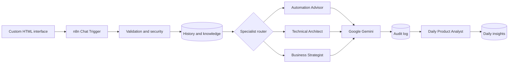

# NOVA

## Commercial AI Automation Intelligence Platform

**A multi-agent automation advisory system powered by n8n, Google Gemini, Supabase, persistent memory, deterministic routing, and product intelligence analytics.**

NOVA is a purpose-built automation intelligence layer—not a generic one-prompt chatbot. It combines a custom responsive chat experience with native n8n orchestration, three specialist AI roles, a persistent Supabase memory layer, domain-grounded retrieval, security checks, a durable audit trail, and a scheduled product intelligence pipeline.

> **Project status:** Portfolio-grade reference implementation. Configure and test it in your own environment before public or commercial deployment.

## Executive overview

NOVA routes each request to a specialist agent instead of sending every question to one undifferentiated model. Its modular agent topology supports:

- automation architecture guidance
- n8n workflow design
- API and Supabase debugging
- security and reliability recommendations
- pricing and commercial strategy
- persistent conversation history
- curated knowledge retrieval
- daily product intelligence reports

The result is a human-readable automation control plane: routing, validation, access boundaries, storage, and telemetry are explicit in the workflow rather than hidden behind a single prompt.

## Why NOVA instead of a generic AI chatbot?

A generic chatbot commonly produces an isolated answer from the current prompt. NOVA adds an operational intelligence layer around the model.

| Capability | Generic chat interaction | NOVA |
| --- | --- | --- |
| Expertise | One general response path | Deterministic specialist routing across three defined roles |
| Context | Often limited to the active conversation | Stateful conversational architecture with durable Supabase history |
| Knowledge | General model knowledge | Curated, domain-grounded retrieval from Supabase |
| Control | Primarily prompt-driven | Explicit validation, routing, storage, and policy-aware request checks |
| Credentials | Depends on the implementation | Server-side credential isolation in n8n |
| Traceability | Limited application telemetry | Durable audit trail with routes, models, metadata, risk flags, and timestamps |
| Product learning | Manual review | Scheduled AI analysis of usage patterns and opportunities |
| Infrastructure | Vendor-managed interface | Self-hostable orchestration and database control plane |

### Specialist roles

- **Automation Advisor** — workflow discovery, n8n architecture, integrations, reliability, and implementation guidance.
- **Technical Architect** — APIs, databases, Supabase, debugging, security, deployment, and system design.
- **Business Strategist** — pricing, proposals, ROI, service packaging, and client positioning.

## Core architecture



See [Architecture](docs/ARCHITECTURE.md) for the agent topology, data model, and system boundaries.

## Request lifecycle

1. The frontend sends a message to the published n8n Chat Trigger.
2. The message and session identity are normalized and validated.
3. The workflow checks length, recent session activity, and suspicious instruction patterns.
4. Previous conversation history is loaded from Supabase.
5. Curated project knowledge is retrieved.
6. Deterministic keyword logic selects the most suitable specialist agent.
7. The selected native AI Agent uses Gemini, conversational memory, Calculator, and Think tools.
8. The response and execution metadata are saved in Supabase.
9. The final answer returns to the custom frontend.
10. A separate scheduled branch generates daily usage and commercial-opportunity insights.

## Technology stack

- n8n
- Google Gemini API
- Supabase / PostgreSQL
- Native n8n AI Agent nodes
- Google Gemini Chat Model nodes
- Simple conversational memory
- Calculator and Think tools
- HTML, CSS, and JavaScript
- REST-style chat webhook communication
- Supabase Row Level Security
- Scheduled analytics workflows

## Major features

- Three domain-specific specialist agents
- Native Gemini integration through n8n
- Persistent Supabase conversation history
- Curated knowledge base
- Input normalization and character limits
- Prompt-risk flagging
- Session-based application rate checks
- Server-side credential isolation
- Responsive editorial chat frontend
- Safe, lightweight Markdown response rendering
- Conversation and route logging
- Daily product analytics
- Native-node-first architecture
- No HTTP Request nodes in the primary workflow

## Repository structure

```text
.
├── README.md
├── LICENSE
├── .gitignore
├── workflow/
│   └── NOVA_Commercial_AI_Automation_Platform_GEMINI_NATIVE_CLEAN.json
├── frontend/
│   └── index.html
├── database/
│   └── supabase_setup.sql
├── docs/
│   ├── ARCHITECTURE.md
│   ├── SETUP.md
│   ├── SECURITY.md
│   └── TESTING.md
└── assets/
    └── .gitkeep
```

## Quick start

### 1. Supabase

1. Create a Supabase project.
2. Open SQL Editor.
3. Run [`database/supabase_setup.sql`](database/supabase_setup.sql).
4. Confirm that `ai_conversations`, `ai_knowledge_base`, and `ai_daily_insights` exist.
5. Confirm that starter knowledge rows were created.

### 2. n8n

1. Import [`workflow/NOVA_Commercial_AI_Automation_Platform_GEMINI_NATIVE_CLEAN.json`](workflow/NOVA_Commercial_AI_Automation_Platform_GEMINI_NATIVE_CLEAN.json).
2. Create or select a native Google Gemini API credential.
3. Create or select a native Supabase API credential.
4. Assign the Gemini credential to every Gemini Chat Model node.
5. Assign the Supabase credential to every Supabase node.
6. Open the Chat Trigger, enable public availability, and use Embedded Chat mode.
7. Restrict Allowed Origins to the exact frontend origin.
8. Publish the workflow and copy its Chat URL.

### 3. Frontend

```bash
cd frontend
python -m http.server 5500
```

Open `http://localhost:5500`, paste the published Chat URL into the connection modal, and keep n8n and the local server running. You may alternatively configure `DEFAULT_WEBHOOK_URL` in `frontend/index.html`; never place an API key there.

Full instructions: [Setup Guide](docs/SETUP.md)

## Required credentials

Only two credential types are required:

- **Google Gemini API**
- **Supabase API**

All real keys must remain in n8n's credential store. The repository intentionally contains credential placeholders only.

## Supabase tables

### `ai_conversations`

Stores session IDs, user messages, assistant responses, selected routes, model information, risk flags, metadata, and timestamps.

### `ai_knowledge_base`

Stores curated automation, technical, security, and commercial guidance used to ground specialist agents.

### `ai_daily_insights`

Stores scheduled product intelligence reports and aggregate metrics derived from conversation activity.

## Security design

- Gemini and Supabase secrets stay inside n8n credentials.
- No provider secret is placed in frontend JavaScript.
- The frontend stores only its Chat URL, browser session ID, and visible chat history.
- Supabase service-role access stays server-side.
- Row Level Security is enabled on the three application tables.
- CORS should allow only the exact deployed frontend origin.
- Suspicious requests are flagged for audit.
- Inputs are normalized and length-restricted.
- Application-level session rate checks are included.

A public deployment should additionally use a reverse proxy, TLS, WAF, infrastructure-level rate limiting, appropriate authentication, monitoring, backups, credential rotation, and a privacy policy. See [Security Model](docs/SECURITY.md).

## Testing

Validate at least these scenarios:

- A general automation question routes to the Automation Advisor.
- A Supabase or API debugging question routes to the Technical Architect.
- A pricing or client question routes to the Business Strategist.
- Multi-turn memory works for the same session.
- Conversations are written to Supabase.
- Input longer than the configured limit is blocked.
- Requests for secrets do not expose credentials.
- Daily analytics creates a row in `ai_daily_insights`.
- The frontend communicates with the published Chat URL.
- Markdown headings and tables render correctly.

Detailed matrix: [Testing Guide](docs/TESTING.md)

## Example prompts

```text
Help me design an n8n lead intake workflow for a small marketing agency.
```

```text
My Supabase insert node is failing. Help me debug the schema, authentication, and field mapping.
```

```text
Help me package and price this AI automation for a client. Include scope, ROI, and a proposal structure.
```

```text
Compare code-built AI agents, n8n agents, generic ChatGPT agents, and specialised AI platforms.
```

## Screenshots

Screenshots are intentionally not fabricated. Add genuine project captures later at:

- `assets/workflow-overview.png` — clean n8n workflow canvas
- `assets/frontend-preview.png` — custom frontend
- `assets/supabase-conversations.png` — conversations table
- `assets/daily-insights.png` — daily insights table
- `assets/specialist-routing.png` — specialist routing execution

## Commercial use cases

- AI automation consultancy assistant
- Internal solution architecture advisor
- Workflow discovery assistant
- Technical troubleshooting assistant
- Proposal and pricing copilot
- Agency knowledge assistant
- Automation training companion
- Client onboarding intelligence system

## Known limitations

- Routing uses understandable keyword logic rather than a trained classifier.
- Simple Memory is local to n8n's agent context; Supabase supplies durable history.
- A `localhost` frontend is available only on the same computer.
- Permanent public access requires hosting n8n and the frontend on reachable infrastructure.
- Application-level rate checks do not replace infrastructure-level protection.
- Gemini model availability, quotas, and free-tier limits can change.
- NOVA provides guidance and does not automatically perform destructive actions.
- Environment-specific security, privacy, and compliance review remains necessary.

## Roadmap

- Authenticated user accounts
- Organization-level tenancy
- Vector search and semantic retrieval
- Administrative dashboard
- Knowledge ingestion pipeline
- Structured feedback collection
- Execution-cost monitoring
- Per-client configuration
- Human approval workflows
- Slack, Teams, and email channels
- Centralized error monitoring
- Evaluation datasets
- Automated regression tests

## Portfolio summary

NOVA demonstrates the design of a stateful multi-agent automation platform using native n8n AI infrastructure, Google Gemini, Supabase persistence, deterministic routing, secure credential boundaries, modular specialist agents, and an independent product-intelligence workflow.

## License

Released under the [MIT License](LICENSE).

