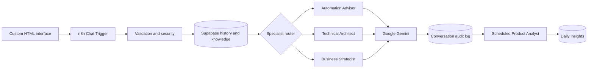

# NOVA Architecture

NOVA is a stateful automation advisory platform built as a human-readable n8n control plane. Explicit workflow logic validates each request, loads durable context, selects a specialist route, invokes a native Gemini-backed agent, and records operational telemetry in Supabase.

## Request lifecycle

1. The browser sends a message and session identifier to the published n8n Chat Trigger.
2. A normalization step validates presence, length, and session identity, and attaches risk flags for suspicious patterns.
3. Application-level logic checks recent activity for the session.
4. Supabase loads durable conversation history and curated knowledge.
5. Deterministic keyword logic selects the Automation Advisor, Technical Architect, or Business Strategist.
6. The selected native AI Agent uses its Gemini model, conversational memory, Calculator, and Think tools.
7. The workflow normalizes the response and stores the message, route, model, metadata, risk flags, and timestamps in Supabase.
8. The answer returns to the custom frontend.
9. An independent scheduled branch analyzes activity and stores daily product intelligence.

## Agent topology

| Agent | Responsibility |
| --- | --- |
| Automation Advisor | n8n workflow design, implementation planning, integrations, reliability, and testing |
| Technical Architect | APIs, Supabase, databases, debugging, security, deployment, and system architecture |
| Business Strategist | Pricing, proposals, ROI, packaging, positioning, and client discovery |
| Product Analyst | Scheduled aggregate analysis of usage, friction, demand, and commercial opportunities |

## Data model

| Table | Purpose |
| --- | --- |
| `ai_conversations` | Durable session history, messages, responses, selected routes, models, risk flags, metadata, and timestamps |
| `ai_knowledge_base` | Curated domain guidance retrieved for specialist responses |
| `ai_daily_insights` | Scheduled product intelligence reports and aggregate metrics |

## Design boundaries

- Routing is explicit and inspectable rather than a trained classifier.
- Native n8n nodes form the primary automation architecture; the workflow contains no HTTP Request node.
- Simple Memory supports agent context inside n8n, while Supabase provides durable history across sessions.
- Credentials stay in n8n's credential store. The browser never receives Gemini or Supabase secrets.
- The system advises users; it does not automatically execute destructive operations.

